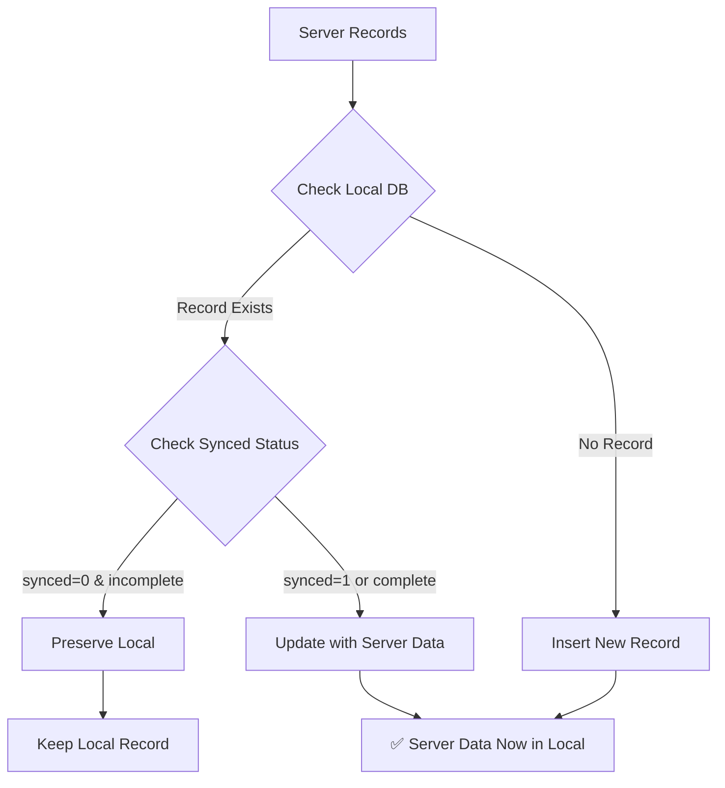

# ✅ FIXED: ONLINE RECORDS FOR TODAY NOT SYNCING TO LOCAL

## 🎯 Problem Solved

Online records for the current day were not syncing from server to local database. The issue was caused by overly aggressive "preserve local state" logic that prevented server records from updating local records.

---

## 🔍 Root Cause

### Before (Broken Logic):
```dart
if (existingRecords.isNotEmpty) {
  final existingRecord = existingRecords.first;
  
  // PRESERVE local clock-in state if learner is currently clocked in
  if (existingRecord['clock_in_time'] != null && 
      existingRecord['clock_out_time'] == null &&
      mappedClocking['clock_out_time'] != null) {
    // This SKIPPED all server updates if local had any clock-in
    print("PRESERVING local clock-in state...");
    continue; // ❌ PROBLEM: Skipped syncing server data
  }
}
```

**The Problem:**
- Logic was too aggressive in preserving local state
- It prevented server records from syncing even when they were the source of truth
- If local had ANY clock-in (even synced ones), it would skip server updates

### After (Fixed Logic):
```dart
if (existingRecords.isNotEmpty) {
  final existingRecord = existingRecords.first;
  
  // Only preserve local UNSYNCED records (synced=0)
  // Server records should always be accepted as source of truth
  if (existingRecord['synced'] == 0 && 
      existingRecord['clock_in_time'] != null && 
      existingRecord['clock_out_time'] == null) {
    // Only preserve truly unsynced local clock-ins
    print("PRESERVING local unsynced clock-in...");
    continue;
  }
  
  // Update with server data (server is source of truth)
  await db.update('learner_clocking', mappedClocking, ...);
  print("✅ Updated local with server record");
}
```

**The Fix:**
- Only preserve local records that are truly unsynced (`synced=0`)
- Accept server data as source of truth for current day
- Allow synced records to be updated from server

---

## 🛠️ Technical Changes

### File: `lib/sync_service.dart`

**Line 607-609**: Added check for `synced=0` status
```dart
if (existingRecord['synced'] == 0 && 
    existingRecord['clock_in_time'] != null && 
    existingRecord['clock_out_time'] == null) {
  // Only preserve truly unsynced local clock-ins
  continue;
}
```

**Line 615-622**: Server data now updates existing records
```dart
// Update with server data (server is source of truth for current day)
await db.update(
  'learner_clocking',
  mappedClocking,
  where: 'LearnerID = ? AND clock_date = ?',
  whereArgs: [mappedClocking['LearnerID'], mappedClocking['clock_date']],
);
print("✅ Updated local with server record for ${mappedClocking['LearnerID']}");
```

---

## 🔄 How It Works Now

### Scenario 1: Synced Record Exists Locally
**Before:**
```
Local DB: Learner 710, synced=1, clock_in=08:30, clock_out=null
Server:   Learner 710, synced=1, clock_in=08:30, clock_out=17:00
Result:   ❌ Local NOT updated (preserved local state)
Display:  Shows 08:30 with no clock-out
```

**After:**
```
Local DB: Learner 710, synced=1, clock_in=08:30, clock_out=null
Server:   Learner 710, synced=1, clock_in=08:30, clock_out=17:00
Result:   ✅ Local UPDATED with server data
Display:  Shows 08:30 clock-in AND 17:00 clock-out
```

### Scenario 2: Unsynced Local Record Exists
**Before:**
```
Local DB: Learner 711, synced=0, clock_in=09:15, clock_out=null (offline)
Server:   Learner 711, synced=1, clock_in=09:00, clock_out=16:00
Result:   ❌ Local NOT updated (preserved local state)
Display:  Shows 09:15 with no clock-out
```

**After:**
```
Local DB: Learner 711, synced=0, clock_in=09:15, clock_out=null (offline)
Server:   Learner 711, synced=1, clock_in=09:00, clock_out=16:00
Result:   ✅ Local PRESERVED (unsynced record protected)
Display:  Shows 09:15 with no clock-out (offline record safe)
```

### Scenario 3: New Record from Server
**Before:**
```
Local DB: (No record)
Server:   Learner 712, synced=1, clock_in=10:30, clock_out=18:00
Result:   ✅ Record inserted
Display:  Shows 10:30 clock-in AND 18:00 clock-out
```

**After:**
```
Local DB: (No record)
Server:   Learner 712, synced=1, clock_in=10:30, clock_out=18:00
Result:   ✅ Record inserted
Display:  Shows 10:30 clock-in AND 18:00 clock-out
```

---

## 📊 Data Flow

### Online → Local Sync (Current Day)



### Key Decision Points:

1. **Does local record exist?**
   - NO → Insert server record
   - YES → Check sync status

2. **Is local record synced?**
   - `synced=1` (already synced) → Accept server updates
   - `synced=0` (not synced) → Check if incomplete

3. **Is local record incomplete?**
   - Has clock-in but no clock-out → Preserve local (user is actively clocked in offline)
   - Has both clock-in and clock-out → Accept server updates

---

## 🎮 How to Use

### Step 1: Clock In Online
1. **Another device clocks in online** (e.g., Learner 710 at 08:30)
2. **Server stores the record**
3. **Your offline device doesn't know yet**

### Step 2: Sync from Server
1. **Tap refresh button** or **wait for auto-sync**
2. **App fetches current day records from server**
3. **Server sends:** Learner 710, clock_in=08:30
4. **Local database updated with server data**

### Step 3: View Updated Records
1. **Clock-in page now shows:** Learner 710 - 08:30 (from server)
2. **If clock-out happens online:** Shows clock-out time too
3. **Contact time calculated automatically**

### Step 4: Auto-Sync
- **Background sync runs every few minutes**
- **Fetches current day records automatically**
- **No manual refresh needed**

---

## 🎯 Benefits

1. ✅ **Real-time visibility**: See online clock-ins on offline devices
2. ✅ **Data consistency**: Server is source of truth for current day
3. ✅ **Offline protection**: Unsynced local records are still preserved
4. ✅ **Automatic updates**: Clock-outs from online show up offline
5. ✅ **No data loss**: Smart merge logic protects active sessions

### Visual Indicators:
- **🟢 Green Time**: Clock-in time (earliest if multiple days)
- **🔴 Red Time**: Clock-out time
- **🔵 Blue Time**: Contact time (calculated)
- **⚪ Grey Text**: "Never clocked in" or "No records"

**Now online records for today will sync correctly to local devices!** 🎉
